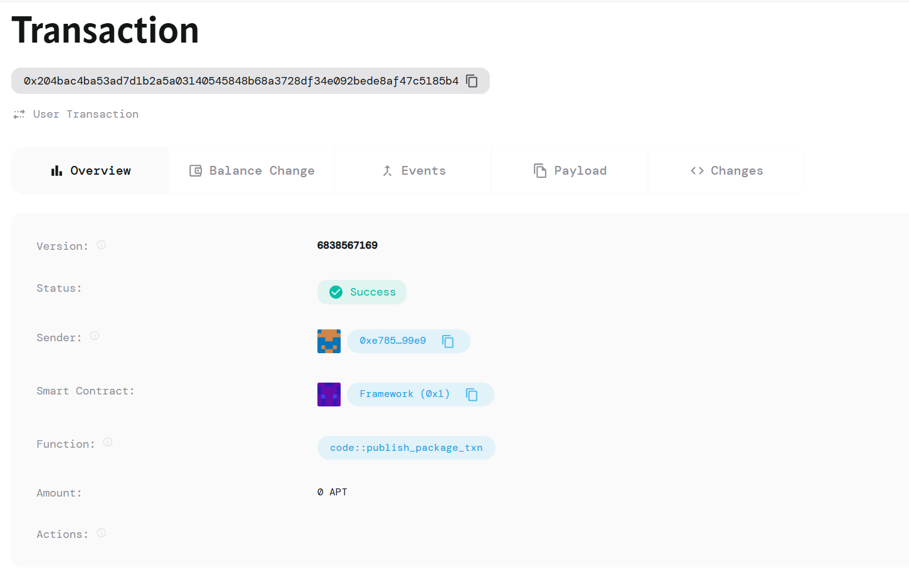

# ChainAid - Transparent Charity Donation & Expense Tracker on Aptos

## Project Description

ChainAid is a revolutionary blockchain-based charity management system built on the Aptos network using the Move programming language. Our platform enables transparent and tamper-proof tracking of donations and expenses for charitable organizations, addressing the critical need for accountability in the charity sector.

The smart contract facilitates secure money transfers between donors, charities, and resource persons (beneficiaries or suppliers), ensuring that all financial activities are permanently recorded on-chain. By leveraging blockchain technology, ChainAid eliminates opacity in charitable operations and builds trust between donors and organizations.

## Project Vision

Our vision is to transform the charity landscape by creating a trustless, transparent ecosystem where:

- **Donors** can track their contributions in real-time and see exactly how their money is being utilized
- **Charitable organizations** can demonstrate their integrity through immutable financial records
- **Beneficiaries** receive aid efficiently through streamlined, automated processes
- **The global community** can verify the impact of charitable initiatives through publicly accessible data

We envision a world where charitable giving is not based on blind trust, but on verifiable transparency, ultimately increasing global participation in philanthropic activities and maximizing the impact of every donation.

## Key Features

### 🔒 **Immutable Transaction Records**
- All donations and expenses are permanently recorded on the Aptos blockchain
- Tamper-proof financial history ensures complete auditability
- Historical data remains accessible and verifiable indefinitely

### 💰 **Multi-Party Transaction Support**
- Secure transfers between donors, charities, and resource persons
- Smart contract-mediated transactions eliminate intermediary risks
- Automated fund distribution based on predefined conditions

### 🔍 **Real-Time Transparency**
- Live tracking of donation flows and expense allocations
- Public dashboard displaying charity performance metrics
- Instant verification of fund utilization for stakeholders

### 🛡️ **Enhanced Security**
- Built on Aptos' secure and scalable blockchain infrastructure
- Move language ensures memory safety and resource protection
- Multi-signature support for organizational fund management

### 📊 **Comprehensive Analytics**
- Detailed reporting on donation patterns and impact metrics
- Expense categorization and allocation tracking
- Performance insights for charity optimization

### 🌐 **Decentralized Verification**
- Community-driven validation of charitable activities
- Peer-to-peer verification mechanisms
- Reduced dependency on centralized authorities

### ⚡ **Cost-Efficient Operations**
- Low transaction fees on the Aptos network
- Optimized smart contract execution
- Reduced administrative overhead for charities

## Future Scope

### Phase 2: Enhanced Functionality
- **Multi-Currency Support**: Integration with various cryptocurrencies and stablecoins
- **Recurring Donations**: Automated subscription-based giving mechanisms
- **Impact Measurement**: AI-powered impact assessment and outcome tracking
- **Mobile Application**: Native iOS and Android apps for better accessibility

### Phase 3: Advanced Features
- **Governance Token**: Community governance through DAO mechanisms
- **NFT Rewards**: Donor recognition through unique NFT certificates
- **Cross-Chain Bridge**: Integration with other blockchain networks
- **Oracle Integration**: Real-world data feeds for enhanced decision-making

### Phase 4: Ecosystem Expansion
- **Charity Marketplace**: Platform for discovering and comparing charitable organizations
- **Volunteer Management**: Blockchain-based volunteer coordination and rewards
- **Supply Chain Tracking**: End-to-end tracking of physical aid distribution
- **Regulatory Compliance**: Built-in compliance tools for different jurisdictions

### Long-term Vision
- **Global Standards**: Establishing ChainAid as the standard for transparent charity operations
- **Educational Programs**: Blockchain literacy initiatives for charity workers
- **Research Partnerships**: Collaboration with academic institutions for impact studies
- **Government Integration**: Partnerships with public sector for transparent aid distribution

## Technology Stack

- **Blockchain**: Aptos Network
- **Smart Contract Language**: Move
- **Frontend**: React.js with Web3 integration
- **Backend**: Node.js with Aptos SDK
- **Database**: IPFS for decentralized storage
- **Analytics**: Custom dashboard with real-time data visualization

## Getting Started

### Prerequisites
- Aptos CLI installed
- Move compiler setup
- Node.js (v16 or higher)
- Yarn or npm package manager

### Installation
```bash
# Clone the repository
git clone https://github.com/your-username/chainaid.git
cd chainaid

# Install dependencies
npm install

# Compile Move contracts
aptos move compile

# Deploy to testnet
aptos move publish
```

## Contributing

We welcome contributions from the community! Please read our [Contributing Guidelines](CONTRIBUTING.md) and [Code of Conduct](CODE_OF_CONDUCT.md) before submitting pull requests.

### Development Process
1. Fork the repository
2. Create a feature branch
3. Implement your changes
4. Write comprehensive tests
5. Submit a pull request

## Community & Support

- **Discord**: [Join our community](https://discord.gg/chainaid)
- **Twitter**: [@ChainAidOfficial](https://twitter.com/chainaidofficial)
- **Documentation**: [Full documentation](https://docs.chainaid.org)
- **Email**: support@chainaid.org

## License

This project is licensed under the MIT License - see the [LICENSE](LICENSE) file for details.

## Acknowledgments

- Aptos Foundation for their robust blockchain infrastructure
- Move language development team
- Open-source contributors and community members
- Partner charitable organizations for their valuable feedback

---

## Contract Details
0x204bac4ba53ad7d1b2a5a03140545848b68a3728df34e092bede8af47c5185b4


---

**Built with ❤️ for transparent charity operations**

*ChainAid - Making every donation count, every transaction transparent.*